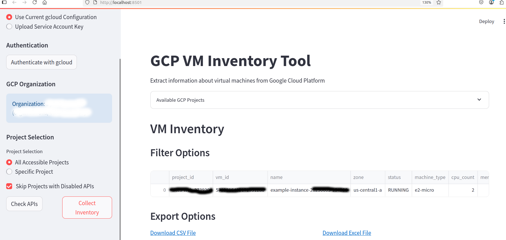

# GCP VM Inventory Tool

This tool extracts information about virtual machines from Google Cloud Platform and exports the data to a CSV file. It provides both a command-line interface and a Streamlit web UI.



## Features

- Lists all VMs across all accessible GCP projects (or a specific project)
- Checks for required API permissions before collecting data
- Provides both CLI and web-based UI options
- Supports authentication via gcloud configuration or service account key
- Extracts key information including:
  - Project ID
  - VM ID and name
  - Operating system information
  - Machine type
  - CPU count and memory
  - Zone
  - Network information
  - IP addresses
  - Creation timestamp

## Prerequisites

- Python 3.6+
- Google Cloud SDK installed and configured
- Appropriate permissions to access GCP projects and VM information

## Installation

### From GitHub

1. Clone this repository:
   ```
   git clone https://github.com/sleroy/gcp_vm_inventory_extraction_script.git
   cd gcp_vm_inventory_extraction_script
   ```

2. Install the package and dependencies:
   ```
   pip install -e .
   ```

### Using pip (coming soon)

```
pip install gcp-vm-inventory
```

## Usage

### Command Line Interface

#### Basic usage (all accessible projects):

```
gcp-vm-inventory
```

#### Specify a single project:

```
gcp-vm-inventory --project your-project-id
```

#### Specify a custom output directory:

```
gcp-vm-inventory --output-dir /path/to/output
```

#### Check API permissions only:

```
gcp-vm-inventory --check-apis-only
```

#### Skip projects with disabled APIs:

```
gcp-vm-inventory --skip-disabled-apis
```

#### Use a service account key:

```
gcp-vm-inventory --service-account-key /path/to/key.json
```

### Streamlit Web UI

1. Start the Streamlit app:
   ```
   streamlit run app.py
   ```

2. Open your web browser to the URL displayed in the terminal (typically http://localhost:8501)

3. Use the sidebar to configure:
   - Authentication method (current gcloud config or service account key)
   - Project selection (all projects or specific project)
   - Other options

4. Click "Check APIs" to verify API permissions
5. Click "Collect Inventory" to gather VM data
6. Use the filtering options to narrow down results
7. Export the data as CSV or Excel using the download links

## Output

The tool generates data with the following fields:

- project_id: The GCP project identifier
- vm_id: The unique identifier of the VM
- name: The name of the VM
- zone: The zone where the VM is located
- status: Current status of the VM (running, stopped, etc.)
- machine_type: The machine type of the VM
- cpu_count: Number of vCPUs
- memory_mb: Memory in MB
- os: Operating system information
- creation_timestamp: When the VM was created
- network: Network name
- internal_ip: Internal IP address
- external_ip: External IP address (if any)

## Contributing

Contributions are welcome! Please feel free to submit a Pull Request.

## License

[MIT License](LICENSE)
